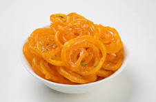

# 🍽️ NutriLens — AI Nutrition Tracker

<p align="center">
  
</p>

<p align="center">
  
  
  
  
  
  
</p>

> An end-to-end AI-powered nutrition tracking web app specifically designed for **Indian cuisine**. Upload a food photo or scan a barcode to instantly get nutrition facts, track daily intake, and receive personalized AI-driven dietary insights.

---

## 📋 Table of Contents

- [Overview](#-overview)
- [Features](#-features)
- [Model Performance](#-model-performance)
- [Tech Stack](#-tech-stack)
- [Project Structure](#-project-structure)
- [Installation](#-installation)
- [Usage](#-usage)
- [Dataset](#-dataset)
- [Notebooks](#-notebooks)
- [Deployment](#-deployment)
- [Notes](#-notes)

---

## 🔍 Overview

NutriLens solves a real problem — most nutrition apps don't recognize Indian food. This app uses a custom-trained **EfficientNet** deep learning model to classify 22 Indian food categories with **90.94% accuracy**, then maps each food to its nutritional data. Users can also scan packaged food barcodes using their webcam for instant nutrition lookup via the **Open Food Facts API**.

---

## ✨ Features

| Feature | Description |
|---|---|
| 📸 **Food Photo Recognition** | Upload a meal photo — AI identifies the food and returns nutrition facts |
| 📦 **Live Barcode Scanner** | Scan packaged food barcodes using your laptop webcam in real time |
| ⚖️ **Custom Portion Adjustment** | Adjust grams consumed and calories/macros recalculate automatically |
| 📊 **Daily Dashboard** | Track calories, protein, carbs and fat with visual progress bars |
| 📜 **Meal History** | View all logged meals grouped by date with daily totals |
| 🤖 **AI Nutrition Insights** | Get personalized dietary tips powered by Groq llama-3.1-8b-instant |
| 💾 **Persistent Logging** | Meal logs saved to `daily_log.json` and persist across sessions |

---

## 🎯 Model Performance

| Metric | Value |
|---|---|
| **Model Architecture** | EfficientNetB1 (Transfer Learning) |
| **Top-1 Accuracy** | **90.94%** |
| **Number of Classes** | **22 Indian Food Categories** |
| **Input Size** | 224 × 224 px |
| **Training Framework** | TensorFlow / Keras |

### 🍛 Supported Food Classes

`Biryani` · `Dosa` · `Paneer Butter Masala` · `Rice` · `Idli` · `Jalebi` · `Samosa` · `Roti` · `Naan` · `Chole Bhature` · `Rajma Chawal` · `Kulfi` · `Poha` · `Vada Pav` · `Pav Bhaji` · and 7 more Indian cuisine categories.

---

## 🛠️ Tech Stack

| Layer | Technology |
|---|---|
| **Frontend** | Streamlit |
| **Deep Learning** | TensorFlow 2.x, Keras, EfficientNetB0 |
| **AI Insights** | Groq API — LLaMA 3.1 8B Instant |
| **Barcode Scanning** | streamlit, OpenCV, pyzbar |
| **Nutrition Data** | Open Food Facts API + custom Indian food DB |
| **Language** | Python 3.12 |

---

## 📁 Project Structure

```
NutriLens/
│
├── app.py                          # Main Streamlit application
├── main.ipynb                      # Project analysis and testing notebook
├── requirements.txt                # Python dependencies
├── README.md                       # Project documentation
├── .gitignore                      # Git ignore rules
│
├── saved_models/
│   ├── food_classifier.h5          # Trained EfficientNet model (54MB)
│   └── labels.json                 # Class index to food name mapping
│
├── notebooks/
│   ├── 01_train_Classifier.ipynb   # Model training pipeline
│   ├── 02_depth_estimation.ipynb   # Depth estimation experiments
│   └── 03_barcode_scanner.py       # Barcode scanner development
│
├── utils/
│   ├── calorie_db.py               # Indian food nutrition database
│   └── daily_log.json              # Persistent meal log storage
│
├── test_images/
│   ├── sample1.jpg                 # Test food image 1
│   └── sample2.jpg                 # Test food image 2
│
└── dataset/                        # ⚠️ Not included in repo (see Dataset section)
    ├── indian_food_dataset/
    ├── indian_food_expanded/
    └── indian_food_val/
```

> ⚠️ `groq_insights.py` is excluded from this repo as it contains local API configuration. The Streamlit app uses **Streamlit Secrets** for the Groq API key instead.

> ⚠️ The `dataset/` folder is excluded due to size. See the Dataset section below.

---

## ⚙️ Installation

### Prerequisites
- Python 3.12+
- pip
- Webcam (for barcode scanning)

### Steps

**1. Clone the repository**
```bash
git clone https://github.com/programcode20/NutriLens.git
cd NutriLens
```

**2. Install dependencies**
```bash
pip install -r requirements.txt
```

**3. Set up Groq API key**

Create a file `groq_insights.py` in the root directory:
```python
from groq import Groq

client = Groq(api_key="your_groq_api_key_here")

def get_insight(food_logs):
    # your implementation
    pass
```

Or set it as an environment variable:
```bash
export GROQ_API_KEY="your_groq_api_key_here"
```

**4. Run the app**
```bash
streamlit run app.py
```

Open your browser at **http://localhost:8501**

---

## 🚀 Usage

### Food Photo Analysis
1. Go to **🏠 Home**
2. Upload a food photo (jpg/png)
3. Click **🔍 Analyze Food**
4. Adjust the **grams consumed** slider
5. Click **✅ Log Meal**

### Barcode Scanner
1. Go to **🏠 Home** → Barcode Scanner panel
2. Click **Start** to activate webcam
3. Hold barcode in front of camera
4. Click **📸 Capture Barcode**
5. Or enter barcode number manually

### Dashboard
- View today's total calories and macros
- Track progress against daily goals
- Click **✨ Get Personalized Insights** for AI tips

---

## 📊 Dataset

The model was trained on a custom Indian food dataset with 3 splits:

| Split | Folder |
|---|---|
| Training | `dataset/indian_food_dataset/` |
| Augmented | `dataset/indian_food_expanded/` |
| Validation | `dataset/indian_food_val/` |

> The dataset is **not included** in this repository due to size constraints. The trained model (`saved_models/food_classifier.h5`) is included and ready to use.

---

## 📓 Notebooks

| Notebook | Description |
|---|---|
| `01_train_Classifier.ipynb` | EfficientNet model training, data augmentation, evaluation |
| `02_depth_estimation.ipynb` | Depth estimation experiments for portion size estimation |
| `03_barcode_scanner.py` | Barcode scanner prototyping with OpenCV and pyzbar |
| `main.ipynb` | End-to-end project analysis, Groq insights integration |

---

## ☁️ Deployment

This app is deployed on **Streamlit Community Cloud**.

To deploy your own instance:

1. Fork this repository
2. Go to [share.streamlit.io](https://share.streamlit.io)
3. Connect your GitHub account
4. Select `programcode20/NutriLens` → `main` → `app.py`
5. Under **Advanced Settings → Secrets**, add:
```toml
GROQ_API_KEY = "your_groq_api_key_here"
```
6. Click **Deploy**

---

## 📝 Notes

- `groq_insights.py` is intentionally excluded from the repo — add your own with your Groq API key
- `dataset/` is excluded due to size — the pretrained model is included
- `daily_log.json` resets on Streamlit Cloud redeploys (no persistent filesystem)
- For local use, meal logs persist normally in `utils/daily_log.json`

---

## 👩‍💻 Author

**Prachi Mohanty**
- GitHub: [@programcode20](https://github.com/programcode20)

---

<p align="center">Made with ❤️ for Indian cuisine 🍛</p>